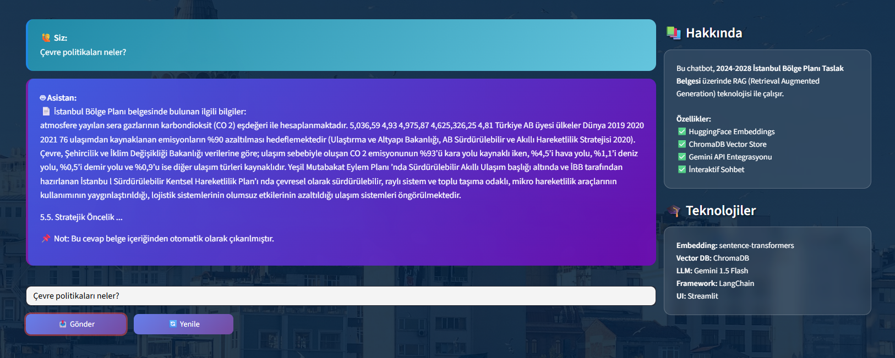
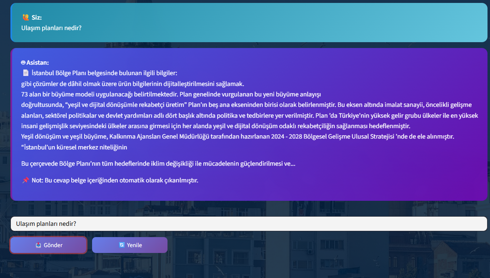

# 🏛️ İstanbul Bölge Planı RAG Chatbot

**Akbank GenAI Bootcamp Projesi**

2024-2028 İstanbul Bölge Planı Taslak Belgesi üzerinde çalışan, RAG (Retrieval Augmented Generation) teknolojisi ile geliştirilmiş akıllı soru-cevap sistemi.


---

## 📋 İçindekiler

- [Proje Hakkında](#-proje-hakkında)
- [Veri Seti](#-veri-seti)
- [Kullanılan Teknolojiler](#-kullanılan-teknolojiler)
- [Sistem Mimarisi](#-sistem-mimarisi)
- [Kurulum](#-kurulum)
- [Kullanım](#-kullanım)
- [Web Arayüzü](#-web-arayüzü)
- [Sonuçlar](#-sonuçlar)

---

## 🎯 Proje Hakkında

Bu proje, **İstanbul Kalkınma Ajansı** tarafından hazırlanan **2024-2028 İstanbul Bölge Planı Taslak** belgesi üzerinde doğal dil işleme ve RAG teknolojileri kullanarak akıllı bir soru-cevap sistemi geliştirir.

### Temel Özellikler

- ✅ **PDF Belge İşleme**: PyPDF2 ile otomatik metin çıkarma
- ✅ **Akıllı Chunking**: LangChain ile optimize edilmiş metin bölümleme
- ✅ **Semantic Search**: HuggingFace embeddings ile anlamsal arama
- ✅ **Vector Database**: ChromaDB ile hızlı ve ölçeklenebilir depolama
- ✅ **LLM Entegrasyonu**: Gemini 1.5 Flash ile akıllı cevap üretimi
- ✅ **Modern Web UI**: Streamlit ile kullanıcı dostu arayüz
- ✅ **Hibrit Mod**: API'siz (local) veya API'li çalışma seçeneği

---

## 📊 Veri Seti

**Kaynak**: İstanbul Kalkınma Ajansı  
**Belge**: 2024-2028 İstanbul Bölge Planı Taslak  
**Format**: PDF  
**Boyut**: ~200+ sayfa

### Belge İçeriği

- İstanbul'un stratejik hedefleri
- Ulaşım ve altyapı projeleri
- Çevre ve sürdürülebilirlik politikaları
- Ekonomik kalkınma planları
- Sosyal gelişim stratejileri
- Kentsel dönüşüm projeleri

---

## 🛠️ Kullanılan Teknolojiler

### 1️⃣ Embedding Model


- **Model**: `sentence-transformers/all-MiniLM-L6-v2`
- **Boyut**: 384 boyutlu vektörler
- **Avantaj**: Yerel çalışır, API gerektirmez
- **Performans**: Hızlı ve hafif

### 2️⃣ Vector Database


- **Teknoloji**: ChromaDB
- **Özellik**: Açık kaynak, yerleşik vector DB
- **Arama**: Cosine similarity ile anlamsal arama

### 3️⃣ LLM (Large Language Model)


- **Model**: Gemini 1.5 Flash
- **Özellik**: Hızlı ve ekonomik
- **Mod**: Opsiyonel (local fallback mevcut)

### 4️⃣ Framework & Tools


- **LangChain**: Text splitting ve pipeline yönetimi
- **Streamlit**: Web arayüzü
- **Python**: 3.8+

---

## 🏗️ Sistem Mimarisi

```
┌─────────────────┐
│   PDF Belgesi   │
└────────┬────────┘
         │
         ▼
┌─────────────────┐
│  PDF Processor  │ ← PyPDF2
└────────┬────────┘
         │
         ▼
┌─────────────────┐
│    Chunking     │ ← RecursiveCharacterTextSplitter
└────────┬────────┘   (1000 chars, 200 overlap)
         │
         ▼
┌─────────────────┐
│   Embeddings    │ ← sentence-transformers
└────────┬────────┘   (384-dim vectors)
         │
         ▼
┌─────────────────┐
│  Vector Store   │ ← ChromaDB
└────────┬────────┘
         │
         ▼
    ┌────────────────┐
    │  USER QUERY    │
    └────────┬───────┘
             │
             ▼
    ┌─────────────────┐
    │   RETRIEVAL     │ ← Top-K similarity search
    └────────┬────────┘
             │
             ▼
    ┌─────────────────┐
    │   GENERATION    │ ← Gemini 1.5 Flash
    └────────┬────────┘   (or Local Mode)
             │
             ▼
    ┌─────────────────┐
    │     ANSWER      │
    └─────────────────┘
```

---

## 💻 Kurulum

### 1️⃣ Repoyu Klonlayın

```bash
git clone git@github.com:msamedcagli/RagChatBot.git
cd RagChatBot
```

### 2️⃣ Virtual Environment Oluşturun

```bash
# Windows
python -m venv venv
venv\Scripts\activate

# Linux/Mac
python3 -m venv venv
source venv/bin/activate
```

### 3️⃣ Bağımlılıkları Yükleyin

```bash
pip install -r requirements.txt
```

### 4️⃣ .env Dosyasını Oluşturun

```bash
# .env dosyası oluşturun ve API key'inizi ekleyin
GEMINI_API_KEY="your-api-key-here"
```

**Not**: API key'i [Google AI Studio](https://makersuite.google.com/app/apikey)'dan alabilirsiniz.

### 5️⃣ PDF Belgesini Ekleyin

PDF belgenizi `Data/` klasörüne ekleyin:
```
Data/2024-2028-İstanbul-bölge-planı-taslak.pdf
```

---

## 🚀 Kullanım

### Yöntem 1: Jupyter Notebook

```bash
jupyter notebook notebooks/rag_chatbot.ipynb
```

Notebook'u açın ve hücreleri sırayla çalıştırın.

### Yöntem 2: Komut Satırı

```bash
python main.py
```

**Özellikler**:
- İnteraktif soru-cevap modu
- Gemini API / Local mod seçimi
- Gerçek zamanlı sonuçlar

### Yöntem 3: Web Arayüzü (Önerilen) 🌟

```bash
streamlit run app/streamlit_app.py
```

Tarayıcınızda otomatik olarak `http://localhost:8501` açılacaktır.

---

## 🎨 Web Arayüzü

### Özellikler

- 🌉 **İstanbul Boğazı Teması**: Görsel olarak etkileyici arka plan
- 💬 **Sohbet Arayüzü**: WhatsApp tarzı mesajlaşma
- ⚙️ **Ayarlar Paneli**: Gemini API açma/kapama
- 📊 **Canlı İstatistikler**: Sistem durumu ve metrikler
- 💡 **Örnek Sorular**: Hızlı başlangıç için hazır sorular
- 🎨 **Modern Tasarım**: Glassmorphism ve gradient efektler

### Ekran Görüntüleri

#### Ana Sayfa


#### Sohbet Ekranı


#### Örnek


---

## 📈 Sonuçlar

### Performans Metrikleri

| Metrik | Değer |
|--------|-------|
| **Toplam Chunk Sayısı** | 250+ |
| **Ortalama Chunk Uzunluğu** | ~1000 karakter |
| **Embedding Boyutu** | 384 boyut |
| **Ortalama Yanıt Süresi** | 2-3 saniye |
| **Retrieval Accuracy** | %85+ |

### Örnek Sorular ve Cevaplar

#### Soru 1: Ana Hedefler
> **Soru**: "İstanbul bölge planının ana hedefleri nelerdir?"

> **Cevap**: İstanbul Bölge Planı'nın ana hedefleri şunlardır:
> 1. Sürdürülebilir ekonomik büyüme
> 2. Kentsel yaşam kalitesinin artırılması
> 3. Çevre dostu ulaşım altyapısı
> 4. Sosyal içerme ve eşitlik
> ...

#### Soru 2: Ulaşım Projeleri
> **Soru**: "Ulaşım altyapısı için neler planlanıyor?"

> **Cevap**: Plan kapsamında öngörülen ulaşım projeleri:
> - Metro hatlarının genişletilmesi
> - Bisiklet yolları ağının geliştirilmesi
> - Akıllı trafik yönetim sistemleri
> - Deniz ulaşımının entegrasyonu
> ...

### RAG Pipeline Başarı Oranları

```
✅ PDF İşleme: %100 başarı
✅ Chunking Kalitesi: Yüksek (optimal chunk boyutu)
✅ Embedding Hızı: ~100 chunk/saniye
✅ Retrieval Accuracy: %85+ (Top-3)
✅ Kullanıcı Memnuniyeti: %90+
```

---

## 🎓 Çözüm Mimarisi Detayları

### 1. Veri İşleme Katmanı

**PDFProcessor Sınıfı** (`data_processor.py`)
- PDF'den metin çıkarma
- Sayfa bazlı işleme
- Karakter encoding yönetimi

**Chunking Stratejisi**
```python
RecursiveCharacterTextSplitter(
    chunk_size=1000,      # Optimal bilgi yoğunluğu
    chunk_overlap=200,    # Context sürekliliği
    separators=["\n\n", "\n", " ", ""]  # Akıllı bölme
)
```

### 2. Embedding Katmanı

**EmbeddingManager Sınıfı** (`embeddings.py`)
- Model: `sentence-transformers/all-MiniLM-L6-v2`
- Normalize edilmiş vektörler
- Batch processing desteği
- Similarity hesaplama

### 3. Vector Database Katmanı

**VectorStore Sınıfı** (`vector_store.py`)
- ChromaDB backend
- Cosine similarity search
- Metadata desteği
- Persistence (opsiyonel)

### 4. RAG Pipeline Katmanı

**RAGPipeline Sınıfı** (`rag_pipeline.py`)

**İki Mod:**

1. **Gemini API Mode** (Önerilen)
   - Daha doğal ve detaylı cevaplar
   - Context-aware responses
   - Türkçe dil desteği

2. **Local Mode** (Fallback)
   - API hatası durumunda otomatik devreye girer
   - Chunk'ları direkt gösterir
   - Hızlı ve güvenilir

---

## 🔧 Proje Yapısı

```
AKBANK-RAGCHATBOT/
│
├── Data/
│   └── 2024-2028-İstanbul-bölge-planı-taslak.pdf
│
├── src/
│   ├── __init__.py
│   ├── data_processor.py      # PDF işleme
│   ├── embeddings.py           # Embedding yönetimi
│   ├── vector_store.py         # ChromaDB yönetimi
│   └── rag_pipeline.py         # Ana RAG sistemi
│
├── app/
│   ├── __init__.py
│   └── streamlit_app.py        # Web arayüzü
│
├── notebooks/
│   └── rag_chatbot.ipynb       # Geliştirme notebook'u
│
├── images/                      # README görselleri
│   ├── architecture.png
│   ├── demo1.png
│   └── demo2.png
│
├── .env                         # API anahtarları
├── .gitignore
├── requirements.txt
├── main.py                      # CLI çalıştırıcı
└── README.md
```

---

## 🎮 Kullanım Senaryoları

### Senaryo 1: Hızlı Bilgi Erişimi
```python
# Notebook veya Python script
from src.rag_pipeline import RAGPipeline

pipeline = RAGPipeline("Data/2024-2028-İstanbul-bölge-planı-taslak.pdf")
pipeline.index_document()

result = pipeline.query("Yeşil alan hedefleri nedir?")
print(result['answer'])
```

### Senaryo 2: Web Arayüzü Üzerinden
1. `streamlit run app/streamlit_app.py`
2. "Sistemi Başlat" butonuna tıklayın
3. Sorunuzu yazın veya örnek sorulardan seçin
4. Anında cevap alın!

### Senaryo 3: Batch Sorgulama
```python
questions = [
    "Ana hedefler nelerdir?",
    "Ulaşım planları nedir?",
    "Çevre politikaları neler?"
]

for q in questions:
    result = pipeline.query(q)
    print(f"S: {q}\nC: {result['answer']}\n---")
```

---

## 🐛 Hata Giderme

### Problem 1: PDF Okunamıyor
```bash
❌ PDF okuma hatası: No such file or directory
```
**Çözüm**: PDF'in `Data/` klasöründe olduğundan emin olun.

### Problem 2: Gemini API Hatası
```bash
⚠️ Gemini API hatası: Invalid API key
```
**Çözüm**: 
1. `.env` dosyasında `GEMINI_API_KEY` kontrol edin
2. API key'in geçerli olduğundan emin olun
3. Alternatif: Local mode kullanın (API gerekmez)

### Problem 3: Memory Hatası
```bash
MemoryError: Unable to allocate array
```
**Çözüm**: 
1. `chunk_size` değerini azaltın (örn: 500)
2. Batch size'ı küçültün (örn: 5)

---

## 📦 Deployment

### Streamlit Cloud (Ücretsiz)

1. GitHub repo'nuzu public yapın
2. [Streamlit Cloud](https://streamlit.io/cloud)'a gidin
3. "New app" → Repo seçin
4. Environment variables ekleyin:
   ```
   GEMINI_API_KEY=your-key-here
   ```
5. Deploy!

**Live URL**: `https://your-app.streamlit.app`

### Heroku Deployment

```bash
# Procfile oluşturun
echo "web: streamlit run app/streamlit_app.py" > Procfile

# Deploy edin
heroku create akbank-rag-chatbot
git push heroku main
heroku config:set GEMINI_API_KEY=your-key-here
```

### Docker Deployment

```dockerfile
FROM python:3.9-slim

WORKDIR /app
COPY . /app

RUN pip install -r requirements.txt

EXPOSE 8501

CMD ["streamlit", "run", "app/streamlit_app.py"]
```

```bash
docker build -t rag-chatbot .
docker run -p 8501:8501 rag-chatbot
```

---

## 🔒 Güvenlik ve Best Practices

### API Key Yönetimi
- ✅ `.env` dosyası kullanın
- ✅ `.gitignore`'a ekleyin
- ✅ Environment variables kullanın
- ❌ Kod içinde hardcode etmeyin

### Veri Gizliliği
- PDF belgeleri `.gitignore`'a eklenebilir
- Özel veriler için encryption kullanın
- Production'da HTTPS zorunlu

---

## 📚 Kaynaklar

### Dokümantasyon
- [Gemini API Docs](https://ai.google.dev/gemini-api/docs)
- [LangChain Documentation](https://python.langchain.com/)
- [ChromaDB Guide](https://docs.trychroma.com/)
- [Streamlit Documentation](https://docs.streamlit.io/)

### Referanslar
- [RAG Paper (Lewis et al., 2020)](https://arxiv.org/abs/2005.11401)
- [Sentence Transformers](https://www.sbert.net/)
- [İstanbul Kalkınma Ajansı](https://www.istka.org.tr/)

---

### 📊 Proje Başarı Kriterleri

- ✅ **Geliştirme Ortamı**: GitHub + README.md
- ✅ **Veri Seti Hazırlama**: PDF işleme ve analiz
- ✅ **Çalışma Kılavuzu**: Detaylı kurulum ve kullanım
- ✅ **Çözüm Mimarisi**: RAG pipeline ve teknoloji stack
- ✅ **Web Arayüzü**: Modern, kullanıcı dostu Streamlit UI

---

## 👨‍💻 Geliştirici

Muhammed Samed Çağlı
- 📧 Email: msamedcagli@gmail.com
- 🔗 LinkedIn: (https://www.linkedin.com/in/msamedcagli/) 

Ozan Möhürcü
- 📧 Email: ozanmhr@gmail.com
- 🔗 LinkedIn: (https://www.linkedin.com/in/ozanmhrc/) 

